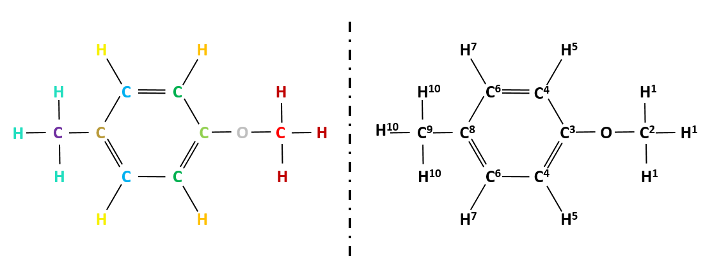

# RANe: an Extension of Schnet-bs Model

source paper:
Hung, S.-H.; Ye, Z.-R.; Cheng, C.-F.; Chen, B.; Tsai, M.-K. *Enhanced Predictions for the Experimental Photophysical Data Using the Featurized Schnet-base Approach.* [ResearchGate](https://www.researchgate.net/publication/367022743_Enhanced_Predictions_for_the_Experimental_Photophysical_Data_Using_the_Featurized_Schnet-bondstep_Approach) (2023)



## How to use RANe

import class `RAN` to [schnetpack1.0/src/schnetpack/representation/schnet.py](https://github.com/atomistic-machine-learning/schnetpack/blob/schnetpack1.0/src/schnetpack/representation/schnet.py) like this example:
```python
from ran import RAN
...

class SchNet(nn.Module):
    def __init__(self, ...):
        ...
        # type = "direct_ran", "sumbatch_ran", "summolecule_ran" or "rane", the default is "direct_ran".
        self.ran = RAN(type)
        ...
    
    def forward(self, inputs):
        ...
        r_ij = self.distances(
            positions, neighbors, cell, cell_offset, neighbor_mask=neighbor_mask
        )
        r_ij = self.ran(atomic_numbers, neighbors, r_ij)
        ...
```

## References

* [1] K. T. Schütt; P.-J. Kindermans; H. E. Sauceda; S. Chmiela; A. Tkatchenko; K.-R. Müller.  
*SchNet: A continuous-filter convolutional neural network for modeling quantum interactions.*
Advances in Neural Information Processing Systems 30, pp. 992-1002 (2017) [Paper](http://papers.nips.cc/paper/6700-schnet-a-continuous-filter-convolutional-neural-network-for-modeling-quantum-interactions)

* [2] K. T. Schütt; P.-J. Kindermans; H. E. Sauceda; S. Chmiela; A. Tkatchenko; K.-R. Müller.  
*SchNet - a deep learning architecture for molecules and materials.*
The Journal of Chemical Physics 148(24), 241722 (2018) [10.1063/1.5019779](https://doi.org/10.1063/1.5019779)

* [3] K. T. Schütt; P. Kessel; M. Gastegger; K. Nicoli; A. Tkatchenko; K.-R. Müller. *SchNetPack: A Deep Learning Toolbox For Atomistic Systems.* J. Chem. Theory Comput. (2018) [10.1021/acs.jctc.8b00908](https://pubs.acs.org/doi/10.1021/acs.jctc.8b00908) [arXiv:1809.01072](https://arxiv.org/abs/1809.01072).

* [4] K. T. Schütt; S. S. P. Hessmann; N. W. A. Gebauer; J. Lederer; M. Gastegger. *SchNetPack 2.0: A neural network toolbox for atomistic machine learning.* [arXiv:2212.05517](https://arxiv.org/abs/2212.05517). (2022)

* [5] Ye, Z.-R.; Hung, S.-H.; Chen, B.; Tsai, M.-K. *Assessment of Predicting Frontier Orbital Energies for Small Organic Molecules Using Knowledge-Based and Structural Information.* ACS Eng. Au, 2, pp. 360–368 (2022) [10.1021/acsengineeringau.2c00011](10.1021/acsengineeringau.2c00011)

* [6] Hung, S.-H.; Ye, Z.-R.; Cheng, C.-F.; Chen, B.; Tsai, M.-K. *Enhanced Predictions for the Experimental Photophysical Data Using the Featurized Schnet-base Approach.* J. Chem. Theory Comput. (2023) [10.1021/acs.jctc.3c00054](10.1021/acs.jctc.3c00054)
